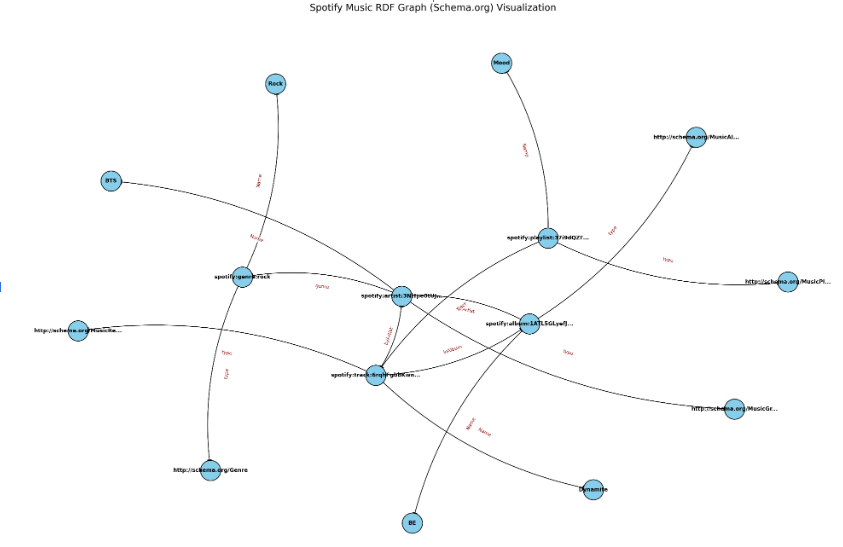
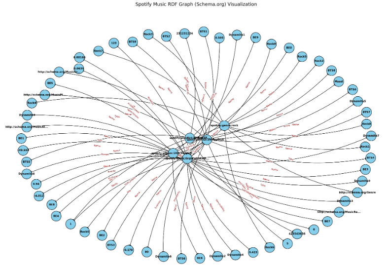
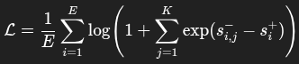
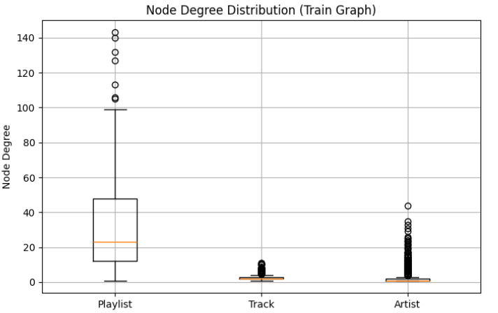
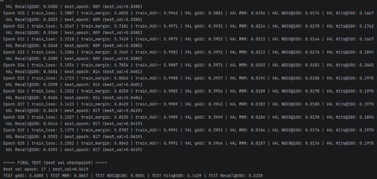

# Preporuka pesama za plejliste pomoću

# grafovskih neuronskih mreža izvedenih

# iz grafa znanja

## Dataset

Podaci plejlisti su dobavljeni iz Spotify million datasets koji sadrži milion plejlisti zajedno sa
njenim osnovnim podacima kao i pesmama na svakoj plejlisti zajedno sa osnovnim podacima
pesama(spotify million). Podaci o muzičarima i žanrovima su dobavljeni sa zvaničnog Spotify
developer API-ja(Spotify Web API) dok su audio svojstva pesama preuzeta sa Reccobeats
API-ja(Reccobeats). Spotify million dolazi u vidu isečenih fajlova te iteracijom kroz fajlove treba
naći ostale podatke kao što su žanrovi, muzičari i audio svojstva ispojiti ih, ovi ostali podaci su
keširani u MongoDB bazi podataka. Keširanje za pesme radi build_track_cache a za muzičare i
žanrove build_artist_cache.

## Graf znanja

Graf poštuje Schema.org ontologiju i mapiranje je sledeće:
Artist -> MusicGroup
Album -> MusicAlbum
Track -> MusicRecording
Playlist -> MusicPlaylist
Genre -> Literal
Za relacije i ostala svojstva predvidjena ontologijom posetiti Schema.org. Takodje audio svojstva
pesama koja su bitna za algoritam učenja nisu predvidjena ontologijom te su naknadno
dodata(danceability, valor, energy, loudness...). Pomoćne funkcije za izgradnju ovog grafa se
nalaze u music_graph dok se iteracija kroz plejliste i korišćenje ovog modula za konkretne
podatke nalazi u build_kg modulo.


Slika 1. Graf bez audio svojstava


Slika 2. Graf sa audio svojstvima
Nakon ograničenog broja iteracija kroz fajlove graf se čuva u RDF formatu.

## Model za preporuku

Build_graph_network služi da učita RDF graf i da ga mapira na Pyg graf pogodan za mašinsko
učenje. Tekstualna obeležja se transformišu pomoću pretreniranog
SentenceTransformer-a(SentenceTransformer) i to se nakon transformacije konkatenira sa
numeričkim svojstvima gde to u stvari predstavlja embedding svakog čvora. U ovakvim
sistemima za preporuku se često koriste bipartitni grafovi(PinSage) gde graf prestavlja
interakciju izmedju kolekcije stvari i samih stvari, međutim ideja se može proširiti u vidu
MultiBiSage. Ovi sistemi se koriste za ogromne grafove gde nije moguće obići ceo graf već
obilaziti najpopularnije komšijske čvorove međutim ovaj sakupljeni graf nije toliko veliki.
```python
---- NODE FEATURES ----
Playlist: x.shape = (145, 256), dtype=torch.float
Artist: x.shape = (2338, 256), dtype=torch.float
Track: x.shape = (3956, 256), dtype=torch.float
---- EDGE INDEXES ----
('Track', 'byArtist', 'Artist'): edge_index.shape = (2, 5222), dtype=torch.int
('Playlist', 'Has Track', 'Track'): edge_index.shape = (2, 4869), dtype=torch.int
```

Listing 1. Podaci o grafu
Obzirom da ćemo koristiti različite tipove čvorova ovaj graf se smatra heterogenim. Svi čvorovi
osim čvorova tipa pesma imaju dinamički embedding koji im se nadodaje obzirom da imaju slab
signal.
Komponente modela su:
```python
self.conv1 = HeteroConv(
{
(src, rel, dst): SAGEConv(in_channels_dict[src], hidden_channels,
normalize=False)
for (src, rel, dst) in self.edge_types
},
aggr='mean'
)
# conv2: hidden -> out
self.conv2 = HeteroConv(
{
(src, rel, dst): SAGEConv(hidden_channels, out_channels,
normalize=False)
for (src, rel, dst) in self.edge_types
},
aggr='mean'
)
self.res_proj = nn.ModuleDict({
ntype: nn.Linear(hidden_channels, out_channels) for ntype in node_types
})
```
Listing 2. Komponente modela, 2 Sage konvolucije i rezidualni spoj sa krajem forward-a
```python
def forward(self, x_dict, edge_index_dict):
x_dict = dict(x_dict)
for ntype in x_dict:
if ntype in self.use_id_emb:
# assumes nodes are 0..N-
ids = torch.arange(x_dict[ntype].size( 0 ),
device=x_dict[ntype].device)
x_dict[ntype] = x_dict[ntype] + self.id_emb[ntype](ids)
# ----- Conv1: input -> hidden -----
x1 = self.conv1(x_dict, edge_index_dict)
x1 = {
k: F.dropout(F.relu(v), p=self.dropout, training=self.training)
for k, v in x1.items()
}


# ----- Conv2: hidden -> out with residual -----
x2 = self.conv2(x1, edge_index_dict)
x2 = {
k: v + self.res_proj[k](x1[k])
for k, v in x2.items()
}
return x
```
Listing 3. Forward
Koraci forward-a

1. Dodavanje dinamičkog embedding-a na odabrane čvorove
2. SageConv
3. ReLu
4. SageConv
5. Rezidualna konekcija

## Pretprocesiranje
```python
transform = T.Compose([T.NormalizeFeatures(),
T.ToUndirected(),
T.RandomLinkSplit(
num_val=0.2,
num_test=0.2,
is_undirected=True,
add_negative_train_samples=False,
# disjoint_train_ratio=0.0,
# neg_sampling_ratio=5,
edge_types=[edge_type],
rev_edge_types=[rev_edge_type]
)
])
train_data, val_data, test_data = transform(data)
```
Listing 4. Transformacije grafa
Učitani graf:

1. Normalizijemo svojstva čvorova
2. Ivice postavljamo da budu neusmerene kako bi povećali protok poruka
3. Delimo na train, val, test(u odnosu 0.6, 0.2, 0.2 respektivno)
Napomena - nikada ne stavljati val_ratio da bude 0.0, Pyg ima bug da onda dopušta data leak,
edge_index bude isti za train i test, message passing treba da bude omogućen SAMO na
trening ivicama

## Negative sampling

Model transduktivno predviđa što znači da čvorovi koji nisu u trening grafu ne mogu biti
korišćeni za predviđanje u evaluaciji, takođe ovo je nadgledano učenje te svaka ivica mora imati
labelu da li postoji(positive) ili ne(negative). Obzirom da je cilj modela traženje konekcija između
plejlista i pesama potrebno je označiti pozitivne ivice sa 1, negative sa 0.

```python
def sample_bpr_negatives_train_only(p_pos, num_tracks, train_pos_set,
num_neg= 10 ):
device = p_pos.device
E = p_pos.size( 0 )
t_neg = torch.randint( 0 , num_tracks, (E, num_neg), device=device)
for i in range(E):
p = int(p_pos[i].item())
for j in range(num_neg):
tn = int(t_neg[i, j].item())
while (p, tn) in train_pos_set:
tn = random.randrange(num_tracks)
t_neg[i, j] = tn
return t_neg
```
Listing 5. Funkcija za traženje matrice koja za svaku pozitivnu ivicu nalazi num_neg negativnih
ivica

## Trening
```python
K = 100
best_state = None
best_val_score = - 1e
best_epoch = - 1
for epoch in range( 1 , epochs + 1 ):
# -------- train step (full-graph) --------
model.train()
optimizer.zero_grad()
out = model(train_data.x_dict, train_data.edge_index_dict)
playlist_emb = F.normalize(out["Playlist"], dim= 1 )
track_emb = F.normalize(out["Track"], dim= 1 )
t_neg = sample_bpr_negatives_train_only(p_pos, num_tracks, train_pos_set,
num_neg= 50 ) #[E, num_neg]
# scores: [E] and [E,num_neg]
pos_scores = (playlist_emb[p_pos] * track_emb[t_pos]).sum(dim= 1 ) # [E]
neg_scores = (playlist_emb[p_pos].unsqueeze( 1 ) * track_emb[t_neg]).sum( 2 ) #
[E,num_neg]
logits = torch.cat([pos_scores.unsqueeze( 1 ), neg_scores], dim= 1 ) # [E,
num_neg+1]
labels = torch.zeros(logits.size( 0 ), dtype=torch.long, device=logits.device)
# positive is index 0


loss = F.cross_entropy(logits, labels)
train_margin = (pos_scores.unsqueeze( 1 ) - neg_scores).mean().item()
train_auc_approx = (pos_scores.unsqueeze( 1 ) >
neg_scores).float().mean().item()
loss.backward()
optimizer.step()
epoch_losses.append(loss.item())
```
Listing 6. Trening

Formula 1. Funkcija greške je cross-entropy po ivicama
Za svaku pozitivnu ivicuimamo num_neg negativnih ivica, za njih se računaju score-ovi između
track i playlist embedding-a i te scorove ubacujemo u funkciju greške. Greška prioritizuje
poklapanje pozitivnih u odnosu na negativne.
Kako graf nije preveliki i koristimo CUDA okvir, nema potrebe za batching-om još uvek, koji bi
takođe doveo do slabosti u vidu da jedan batch nosi deo grafa, tako da global negative
sampling ne bi bio moguć te da bi preporuke bile vezane za batch raspodelu, ovo se može
poboljšati redefinisanjem Loader-a pre početka svake epohe, međutim empirijski ovi rezultati su
se pokazali lošim.

## Validacija i evaluacija

Validacija i evaluacija koriste iste metrike za prikaz međutim metrika koji koristimo za najbolji
model u validaciji će biti Recall@K, jer je najbitnije da se obuhvati što više pesama koje zapravo
jesu u plejlisti i da se nalaze u top K preporuka, ali nije nam bitan redosled. Ostale metrike koje
smo posmatrali trening margina, gAUC, MRR, NDCG, Hits@K, za više o ovim metrikama
pogledati poredjenje metrika.

## Rezultati

Rezultati su daleko od idealnih medjutim uz dalji rad verujem da se mogu popraviti.


Slika 3. Funkcija greške
Model uči međutim iako stepeni playlist čvorova idu i do 140, stepeni track čvorova su izuzetno
mali i ne prelaze 12 i ovo je problem jer Reccobeats API nema podatke za dosta pesama te ih u
izdradnji grafa modul ignoriše, zvaničan Spotify API za audio svojstva je ukinut tako da
korišćenjem drugih API-ja ili preuzimanje modela koji su sposobni da izvuku svojstva smatram
da bi ispravilo ovo dosta stoga ovo bi bio sledeći korak.


Slika 4. Box plotovi stepena čvorova

Slika 5. Najbolji Recall@K je 0.


